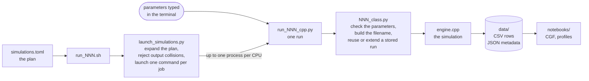
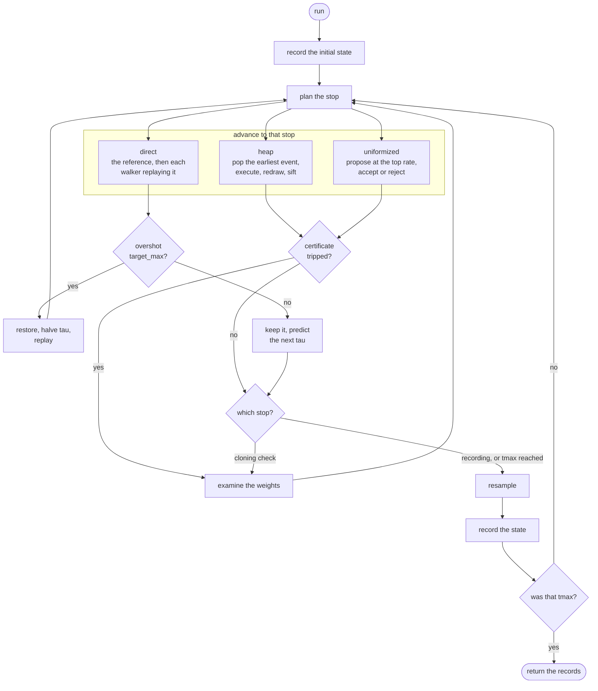
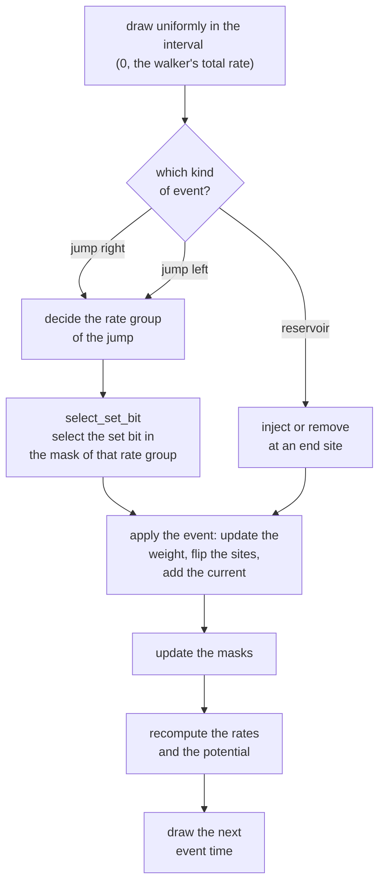

# How a run flows

This is a code-level map of one simulation. It follows a TOML plan through launch, execution, and storage, then zooms in on the run loop and how a single event is generated, before comparing the three event mechanisms. The diagrams are a route into the code, not another account of the physics or user interface.

The details deliberately left out here live in the surrounding documentation:
[`LAUNCHER.md`](LAUNCHER.md) defines the plan format,
[`theory_algorithm_implementation.pdf`](theory_algorithm_implementation.pdf)
derives the method, [`OUTPUT_CONVENTIONS.md`](OUTPUT_CONVENTIONS.md) defines the
results and restart rules, and [`CPU_REQUIREMENTS.md`](CPU_REQUIREMENTS.md) explains the processor requirements and the hardware-dependent code path.

## Vocabulary

All of this is introduced properly in
[`theory_algorithm_implementation.pdf`](theory_algorithm_implementation.pdf).
What follows is a summary of the terms the diagrams below use, so that this
file can be read on its own.

- **Walker** — one trajectory in the population, biased towards rare currents.
- **Reference** — a single untilted trajectory, used for the monitoring overlap.
- **Potential** `V_i` — the instantaneous rate at which walker `i`'s weight
  grows or shrinks.
- **Stop** — an instant at which the whole population is brought to the same
  time: the next cloning check, the next recording, or `tmax`.
- **Block** — everything that happens between two consecutive stops.
- **Predicted step** `tau` — the dynamical interval `direct` sets for its next cloning check. The other two mechanisms do not predict one.
- **Resampling** — replacing the weighted population by `M` equally weighted
  descendants, preserving the influence of the old weights in the normalization.
- **Certificate** — a running upper bound on how far the weights can have spread. Only a mechanism that keeps one global clock can watch it.
- **Bond** — a neighbouring pair of sites, across which a particle may hop.
- **Rate group** — a hop's rate depends only on the two sites flanking the
  pair, and those have four occupation patterns, so the allowed hops in each
  direction fall into four rate groups. Every hop in a group thus shares the same rate.
- **Mask** — one word per rate group, with bit `b` set when bond `b` currently
  permits a hop of that group. Counting the set bits gives the rate; finding
  the `n`-th picks the bond.

## 1. From a plan to a figure

Essentially, a run can be started in two ways, and they meet at `run_NNN_cpp.py`. A plan goes through the
launcher, which expands it into one job per parameter combination and starts them a
few at a time; a single run can equally be typed straight into the terminal. The
launcher builds precisely the command line you would have typed, so nothing below that
point knows which way it was reached.

The wrapper is
[`Simulator/Python_Cpp_Interface/NNN_class.py`](../Python_Cpp_Interface/NNN_class.py)
and the engine [`Simulator/cpp/engine.cpp`](../cpp/engine.cpp). Before starting
the engine, the wrapper looks in `data/` for a result whose parameters match: an
equal one is returned as it stands, and a shorter one is resumed from its
checkpoint so that only the missing time is simulated. What counts as a match is
set out in [`OUTPUT_CONVENTIONS.md`](OUTPUT_CONVENTIONS.md).

## 2. The run loop, in all three mechanisms at once

Each pass through the following loop covers one block. All three mechanisms share
the same recording grid and, once a block is over, record and resample identically. They
differ in how the resampling times are found -- predicted in advance, or discovered
as the run proceeds -- and in how the population is carried to them.

The stop is the earliest of the following: the next cloning check, the next recording, and `tmax`. `heap` and `uniformized` keep one global clock, so the certificate can be watched continuously and the block is cut the instant the bound is reached;
`direct` advances each walker separately, so it has no running certificate. It estimates `tau` instead, judging the block only once it is over.

Examining the weights is not the same as resampling. The certificate is an upper bound, so the exact weights' range may still be within `target_min`, in which case nothing is resampled. A recording is the one stop that resamples regardless, on its own account. On the other hand, if the weights' range is larger than `target_min`, resampling occurs. 

In `direct` simulation, `tau` shrinks fast and grows slowly: a block that overshoots `target_max` is
discarded and replayed at half the step, while a block that holds may at most
double it.

## 3. One accepted event

The path every walker event takes, in the rejection-free mechanisms.

The particular implementation of all these steps is more explicitly detailed in
[`theory_algorithm_implementation.pdf`](theory_algorithm_implementation.pdf).
The route `select_set_bit` takes to pick the set bit is decided by the processor, as explained in [`CPU_REQUIREMENTS.md`](CPU_REQUIREMENTS.md). 

## 4. Why three mechanisms

All three implement the same process and are checked against each other, so the
choice is according to simulation cost rather than of physics.

| mechanism | how the next event is found | rejections | cost | why it is kept |
| --- | --- | --- | --- | --- |
| `direct` | each walker runs alone between stops| none | fastest; the default | it is the most efficient |
| `heap` | every process holds one pending time; a binary heap keeps the earliest at the front | none | 1.2–2.8× `direct` | true chronological order, and an idea that may be useful elsewhere |
| `uniformized` | one clock at the heaviest possible rate proposes any jump between adjacent sites | rejected down to the true rate | 2.7–5.1× `direct` | simple enough to be obviously correct, so it benchmarks the other two |

The cost column is measured, not estimated. Figures 5 and 6 of [`theory_algorithm_implementation.pdf`](theory_algorithm_implementation.pdf) time the three mechanisms against lattice size and against population, for each model separately, and Section 1.5.2 reads the speedups off them.

## Where to look in the code

Every function below is in [`Simulator/cpp/engine.cpp`](../cpp/engine.cpp).

| what it does | function |
| --- | --- |
| the whole loop of section 2 | `Simulation::run` |
| plan the stop | `Simulation::schedule_next_cloning_check` |
| carry the population to that stop | `HeapDynamics::advance_weighted`, `UniformizedDynamics::advance_weighted`, `DirectDynamics::advance_weighted` |
| watch the certificate while advancing | `accumulate_weight_bound`, `weight_bound_reached` |
| judge a finished block and set the next `tau`, in `direct` alone | `DirectDynamics::review_block` |
| examine the weights, and resample if they have spread far enough | `Simulation::clone_population` |
| record the state | `Simulation::output_record` |
| choose one event, as in section 3 | `Simulation::execute_walker_event`, `select_within_direction`, `select_set_bit` |
| apply that event to the walker | `Simulation::apply_walker_event` |
| update the masks | `update_masks_near`, `rebuild_masks_uniform` |
| draw the next event time | `exponential_wait` |
| give the whole population fresh event times after resampling | `draw_event_times` |
