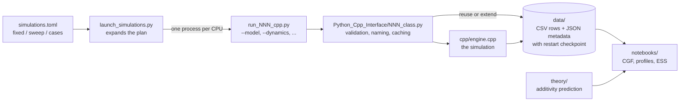
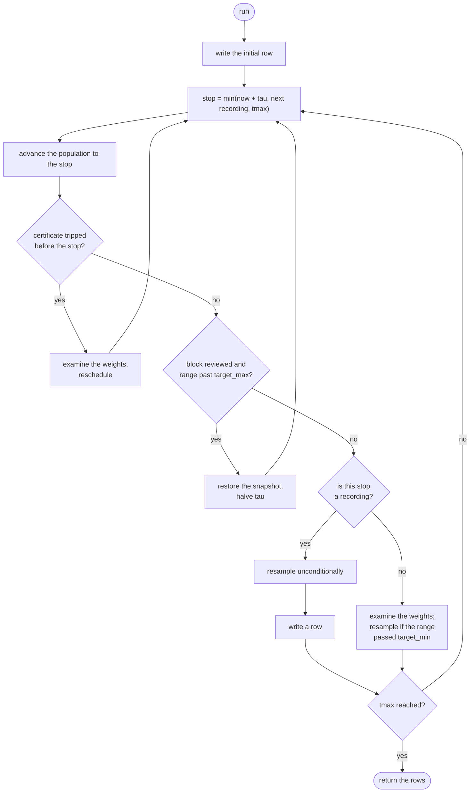
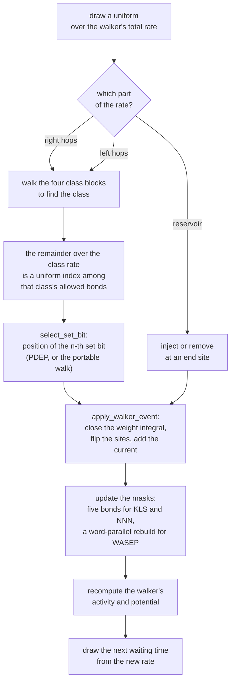

# How a run flows

Four views of the same computation, from the outside in. The diagrams render
directly on GitHub.

## Vocabulary

- **Walker** — one trajectory in the population, biased towards rare currents.
- **Reference** — a single untilted trajectory, used for the monitoring overlap.
- **Potential** `V_i` — the instantaneous rate at which walker `i`'s weight
  grows or shrinks.
- **Stop** — an instant at which the whole population is brought to the same
  time: the next cloning instant, the next recording, or `tmax`.
- **Block** — everything that happens between two consecutive stops.
- **Resampling** — replacing the weighted population by `M` equally weighted
  descendants, preserving the influence of the old weights in the normalization.

## 1. From a plan to a figure

## 2. The run loop

One iteration per block. The certificate branch belongs to the single-clock
mechanisms; the review branch to `direct`.

## 3. One accepted event

The path every walker event takes, in the rejection-free mechanisms.

## 4. What the three mechanisms do differently

```mermaid
flowchart TD
    subgraph heap["heap"]
        h1["every process holds<br/>one pending event time"] --> h2["a binary heap keeps<br/>the earliest at the front"]
        h2 --> h3["execute it, redraw,<br/>sift, repeat"]
        h3 --> h4["one global clock, so the<br/>weight certificate can be<br/>watched continuously"]
    end
    subgraph uniformized["uniformized"]
        u1["one global clock at the<br/>heaviest possible rate"] --> u2["pick a process and a<br/>transition uniformly"]
        u2 --> u3["accept against the true rate<br/>and the exclusion rule,<br/>otherwise count a rejection"]
        u3 --> u4["same certificate;<br/>kept as an independent check"]
    end
    subgraph direct["direct"]
        d1["reference first, its events<br/>stored for the block"] --> d2["then each walker alone,<br/>replaying those events"]
        d2 --> d3["no global clock, so no<br/>running certificate"]
        d3 --> d4["tau is predicted, the block<br/>is judged afterwards and<br/>replayed if it overshot"]
    end
```

## Where to look in the code

| stage | function |
| --- | --- |
| the loop above | `Simulation::run` |
| the stop schedule | `Simulation::schedule_next_cloning_check` |
| the block review | `DirectDynamics::review_block` |
| event selection | `Simulation::execute_walker_event`, `select_within_direction`, `select_set_bit` |
| applying an event | `Simulation::apply_walker_event` |
| mask maintenance | `update_masks_near`, `rebuild_masks_uniform` |
| the certificate | `accumulate_weight_bound`, `weight_bound_reached` |
| resampling and the estimator | `Simulation::clone_population` |
| the recorded row | `Simulation::output_record` |
