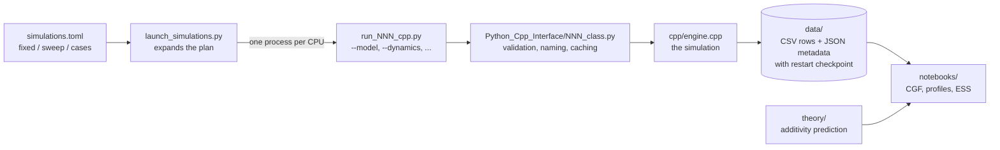
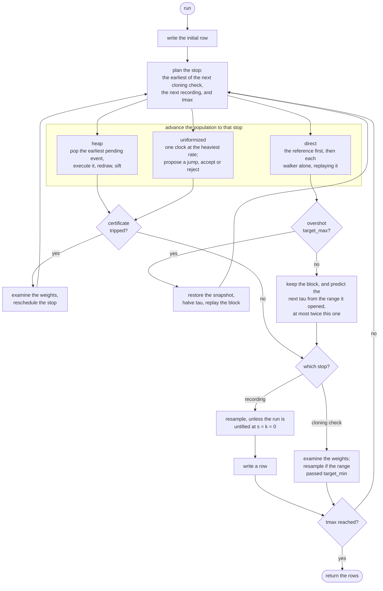
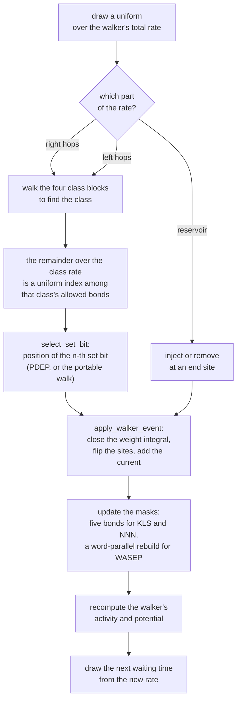

# How a run flows

Four views of the same computation, from the outside in. The diagrams render
directly on GitHub.

Two companion documents pick up where this one stops:
[`OUTPUT_CONVENTIONS.md`](OUTPUT_CONVENTIONS.md) for what a run writes, how the
files are named, and how caching and restarts work;
[`CPU_REQUIREMENTS.md`](CPU_REQUIREMENTS.md) for the bit-selection step that
dominates the cost of an event.

## Vocabulary

- **Walker** — one trajectory in the population, biased towards rare currents.
- **Reference** — a single untilted trajectory, used for the monitoring overlap.
- **Potential** `V_i` — the instantaneous rate at which walker `i`'s weight
  grows or shrinks.
- **Stop** — an instant at which the whole population is brought to the same
  time: the next cloning check, the next recording, or `tmax`.
- **Block** — everything that happens between two consecutive stops.
- **Resampling** — replacing the weighted population by `M` equally weighted
  descendants, preserving the influence of the old weights in the normalization.
- **Certificate** — a running upper bound on how far the log-weights can have
  spread. It can only be watched by a mechanism that keeps one global clock.

## 1. From a plan to a figure

Before starting the engine, the wrapper looks in `data/` for a result whose
parameters match: an equal one is returned as it stands, and a shorter one is
resumed from its checkpoint so that only the missing time is simulated. The
rules that decide what counts as a match are in
[`OUTPUT_CONVENTIONS.md`](OUTPUT_CONVENTIONS.md).

## 2. The run loop, in all three mechanisms at once

One iteration per block. All three mechanisms plan the same stops and, once
the block is over, record and resample identically; they differ only in how the
population is carried to the stop, and in how that block is then judged.

`heap` and `uniformized` keep one global clock, so the certificate can be
watched continuously and a block is cut the instant the bound is reached.
`direct` advances each walker separately, so there is no global clock and no
running certificate: it predicts `tau` instead, and judges the block afterwards.

Reaching the certificate is not by itself a reason to resample: it is an upper
bound, so the weights are examined and the exact range may turn out to be
within `target_min` after all. Shrinking `tau` is immediate and growing it is
capped at a factor of two, so one lucky block cannot stretch the next one out
of range.

## 3. One accepted event

The path every walker event takes, in the rejection-free mechanisms.

Which of the two routes `select_set_bit` takes is decided once, when the
extension module loads, and why is the subject of
[`CPU_REQUIREMENTS.md`](CPU_REQUIREMENTS.md).

## 4. Why three mechanisms

All three implement the same process and are checked against each other, so the
choice is one of cost rather than of physics.

| mechanism | how the next event is found | rejections | cost | why it is kept |
| --- | --- | --- | --- | --- |
| `direct` | each walker runs alone between stops, replaying the reference's stored events | none | fastest; the default | it is the most efficient |
| `heap` | every process holds one pending time; a binary heap keeps the earliest at the front | none | 1.2–2.8× `direct` | true chronological order, and an idea that may be useful elsewhere |
| `uniformized` | one clock at the heaviest possible rate proposes any jump between adjacent sites | rejected down to the true rate | 2.7–5.1× `direct` | simple enough to be obviously correct, so it benchmarks the other two |

Only `uniformized` reports a non-zero `RejectedWalkerEvents`; the other two
never propose an event they do not take. `heap` and `uniformized` reproduce the
earlier single-model engine bitwise, while `direct` consumes the random stream
in its own order and so agrees in distribution rather than per seed. The full
account, with the measurements behind the cost column, is in
[`theory_algorithm_implementation.tex`](../../theory_algorithm_implementation.tex),
sections *The algorithm* and *Implementation*.

## Where to look in the code

| stage | function |
| --- | --- |
| the loop above | `Simulation::run` |
| the stop schedule | `Simulation::schedule_next_cloning_check` |
| advancing a block | `HeapDynamics::advance_weighted`, `UniformizedDynamics::advance_weighted`, `DirectDynamics::advance_weighted` |
| the block review | `DirectDynamics::review_block` |
| event selection | `Simulation::execute_walker_event`, `select_within_direction`, `select_set_bit` |
| applying an event | `Simulation::apply_walker_event` |
| mask maintenance | `update_masks_near`, `rebuild_masks_uniform` |
| the certificate | `accumulate_weight_bound`, `weight_bound_reached` |
| resampling and the estimator | `Simulation::clone_population` |
| the recorded row | `Simulation::output_record` |
